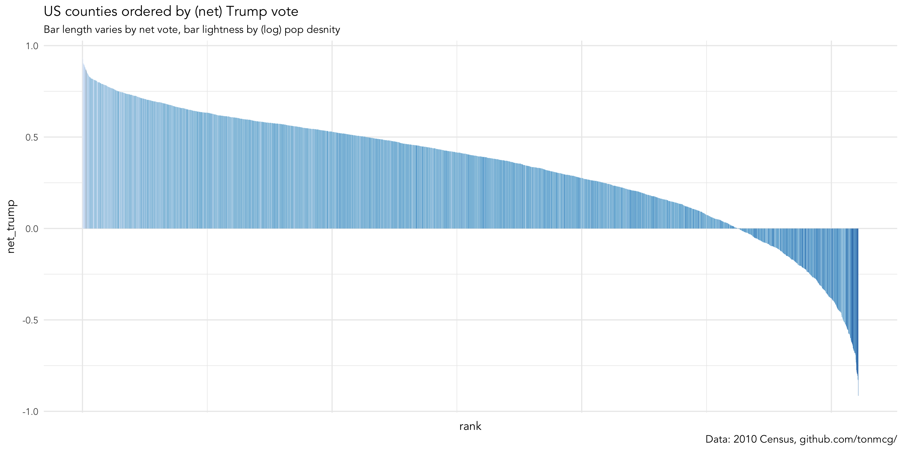
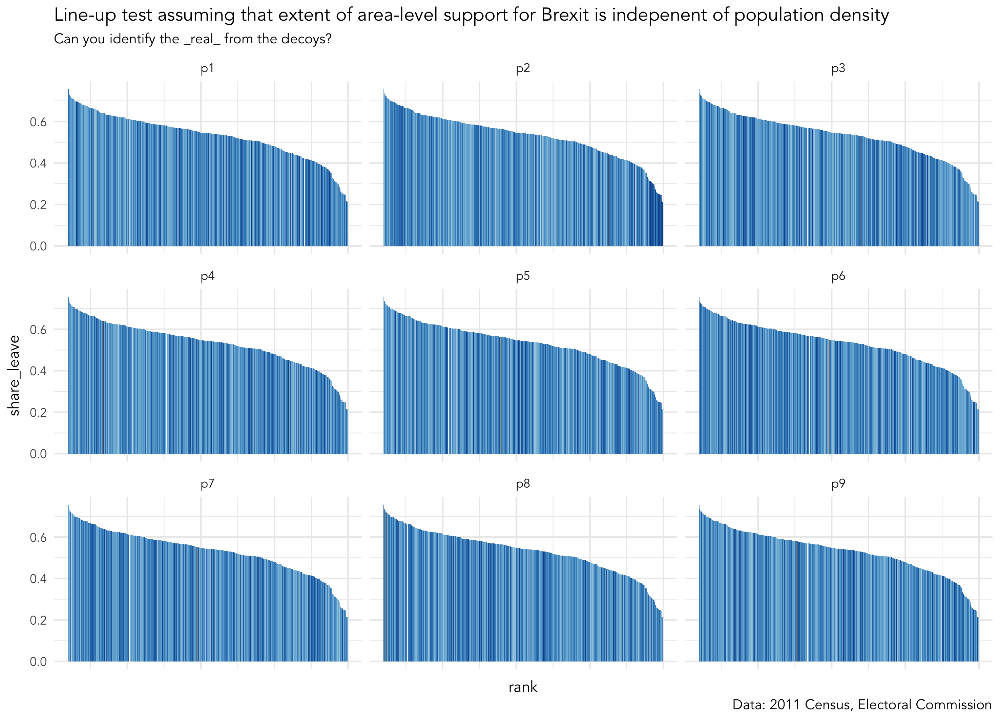
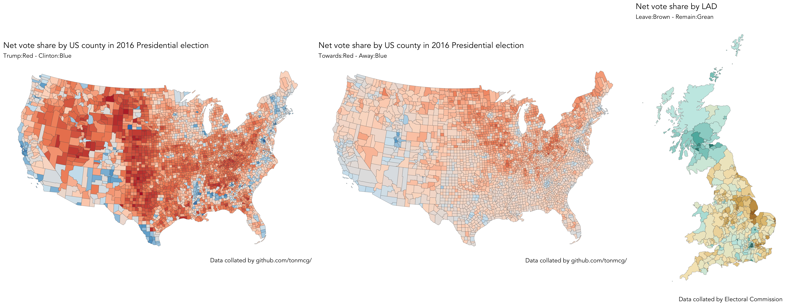
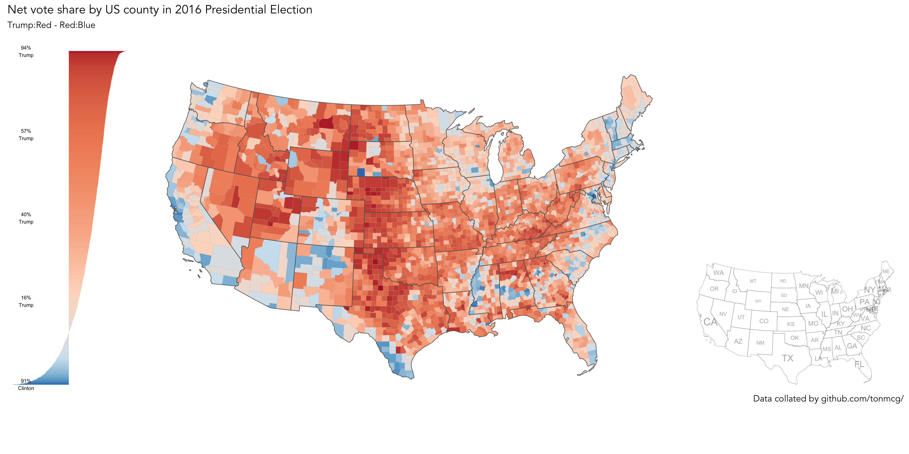

= Explaining Trump and Brexit with Tidy Data Graphics
By <https://www.roger-beecham.com[Roger Beecham]>
:docinfo1: menu-include.adoc
:icons: font
:source-highlighter: rouge
:source-language: R
:task: sidebar
:aside: NOTE
:stem: latexm
:fig: TIP
:alert: WARNING
:specification: source, R

include::menu-include.adoc[]

****
In this session you will:

* continue to perform data wrangling activities (`dplyr`)
* produce a visual equivalent of a permutation-based statistical test
* extend `ggplot2` specifications to generate choropleth maps

****

== Explore structure in area-level voting behaviour

=== Task 1. Update your bar chart 1: population density and voting behaviour

You will recall from the histogram at the end of the previous session that the _net_trump_ variable has a negative skew: many more counties voted in favour of Trump than Clinton. This distribution becomes even more interesting when you consider the popular vote share (48% Clinton | 46% Trump).

This fact prompts questions that can inform our visual data analysis. For example, if many more counties voted Trump than Clinton, but more people in absolute terms voted for Clinton, then pro-Clinton counties are likely more densely populated than are pro-Trump counties. We can investigate this by slightly affecting our _ggplot2_ specification to draw separate bars for each US county, with bar height mapped to _net_trump_ , bars ordered according to this variable and bar colour mapped to _population density_.

[{specification}]
--
# Take another look at the distribution of the net_trump variable.
trump %>%
  mutate(rank=row_number(-net_trump)) %>%
  ggplot(aes(x=rank, y=net_trump, fill=log(pop_density)))+
  geom_col(width=1)+
  scale_fill_distiller(palette = "Blues", direction=1, guide="none")
--

.Figure 1: Bar chart summarising _net_trump_ variable.
--

--

[{task}]
--
[horizontal]
Instructions:: Add the code block to your R script and run.

Individual task:: Produce a bar chart for the `net_leave` vote (e.g. the same _ggplot2_ specification but applied to the Brexit dataset). Next, affect the _ggplot2_ specification such that `fill` is mapped to _net trump_ (US) and _net leave_ (GB). Since these variables are signed quantities it makes sense to map to a http://colorbrewer2.org/#type=diverging&scheme=BrBG&n=3[diverging] `palette`  -- say `RdBu` for Trump, `BrBG` for Brexit. Update your specification accordingly. Keen observes may notice the visual redundancy here: we're double encoding  (encoding the vote margin variables onto fill and height) and therefore wasting a visual channel. There's a reason for this though -- so don't discard the code.
--

=== Task 2. Update your bar chart 2: test for population density and voting behaviour

We've so far established that there is variation in county-level voting for Trump and LAD-level voting for Brexit and that this variation may be systematic. Glancing at Figure 1 there seems to be a general left-to-right trend in bar lightness: counties with lower vote shares for Trump tend to be less populated. For the Brexit data this pattern exists to a lesser extent. You will have noticed that for both the Trump and Brexit plots the association between voting preference and population density is most evident towards the end of the distribution -- the darkest bars appear at the extreme right of the plot. We'll be dealing with these sorts of *associations* more formally in the next session. For now, we can investigate this by performing a visual line-up test under the assumption that voting preference varies independently of population density. We construct copies of the our dataset but randomly swap (permute) the values of the population density variable. We then plot each of these copies -- or _decoy_ plots -- and amongst the decoys add the _real_ dataset (Figure 2). If we can successfully identify the _real_ from the decoys then this adds credibility to our claim that extent of area-level Trump / Brexit support varies with population density.

Keen observes will have noticed that Figure 2 is effectively a visual equivalent of a null hypothesis test. The idea was first proposed in Hadley Wickham _et al._'s influential paper on _graphical inference_ (http://ieeexplore.ieee.org/document/5613434/[Wickham et al. 2010]). There are various challenges associated with performing tests in this way -- I (with colleagues) investigated some of these when applying line-up tests to geo-spatial data (https://www.gicentre.net/maplineups[Beecham et al. 2017]). However, the visual element allows informal testing of structure that would be difficult to test through a numerical equivalent. For example, scanning across the line-up by eye we can look for a consistent pattern at the extremes of the distribution --  it's pretty obvious that LADs with the least Brexit are the most densely populated. However, the patterns isn't so obvious outside of these extremes. A separate lineup excluding the _most_ heavily Leave LADs would allow a more direct read on this.

.Figure 2: Example line-up test.
--

--

[{specification}]
--
# I've created a function for generating line-up data. Load it into your R session.
source(paste0(session_url, "./src/do_lineup.R"))

# Create lineup data.
lineup_data <- brexit %>%
  mutate(value=log(pop_density)) %>%
  select(share_leave, value)
# Remove the geometry data (there's a boring reason for this).
st_geometry(lineup_data) <- NULL
lineup_data <- do_lineup(lineup_data, 2)

# Plot the line-up.
lineup_data %>%
  mutate(rank=-row_number(share_leave)) %>%
  select(-real) %>%
  gather(key="perm", value="perm_values", -c(rank, share_leave)) %>%
  ggplot(aes(x=rank, y=share_leave, fill=perm_values))+
  geom_col(width=1)+
  scale_fill_distiller(palette = "Blues", direction=1, guide="none")+
  facet_wrap(~perm)+
  theme(axis.text.x = element_blank())
--

[{task}]
--
[horizontal]
Instructions:: Add the code block to your R script and run. If you're keen you may wish to re-run on the Trump data. Additionally, do shout at this point if you want a fuller explanation of the code. If you're very new to programming, the code encapsulated in `do_lineup()` is probably worth avoiding for now.
--

[{aside}]
--
At this point, you might be exasperated by the fact that you've been copying and pasting plenty of code snippets but have no idea what the code is instructing R to do (because it's not been properly explained). This was a deliberate strategy as I really want to demonstrate how graphics can be used in _Tidyverse_ workflows to quickly support analytic thinking. If I've not already broken off to do some 'live coding' to demonstrate what's happening in these code blocks, then do shout out at this point!
--

=== Task 3. Swap bars for (spatially ordered) polygons: create _maps_ of the results data

The analysis above suggests a spatial element to area-level voting behaviour -- or at least that variation may be systematic with different _categories_ of location. Of course, you  already know this to be the case (unless you missed the 2016 news coverage and link:data-vis.html[Data Visualization] page). Hopefully you'll see from the code below that we can quickly generate https://en.wikipedia.org/wiki/Choropleth_map[choropleth maps] of the results data by affecting our _ggplot2_ specification to transition from 1-d ordered bars to spatially ordered polygons.

The maps displaying the _net_trump_ and _net_leave_ variables are probably familiar to you. Whilst London and Scotland overwhelmingly voted in favour of Remain, the vast majority of LADs in England and Wales voted Leave. You might be able to spot a few exceptions -- the green blob representing Cambridgeshire, with an even darker centre for Cambridge city. The _net_trump_ map is a also reasonably familiar pattern of Republican versus Democrat voting. The _shift_trump_ map is interesting. Whilst _shift_trump_ is present across much of the US (87% of counties experienced an enlarged Republican vote share from 2012), the extent of shift is most apparent in historically blue-collar counties located around the Great Lakes area and rural North East. You will recall that this pattern was neatly captured in the https://www.washingtonpost.com/graphics/politics/2016-election/election-results-from-coast-to-coast/[The Washington Post] maps. After lunch, we will develop graphics that explore whether or not these interesting area-level patterns vary with with demographics and local context in consistent and predictable ways.

[{specification}]
--
# If you are working from your own machine and have the development version of ggplot2 loaded.
# Paired-back choropleth map of net_trump vote using geom_sf
trump %>%
  ggplot()+
  geom_sf(aes(fill = net_trump), size=0.1)+
  coord_sf(crs = st_crs(trump), datum = NA)+
  scale_fill_distiller(palette="RdBu", direction=-1, guide="colourbar", limits=c(-0.95,0.95), name="")

# If you are working from a lab machine, use the tmap package.
# The way in which tmap objects are parameterised is similar ggplot2.
trump %>%
  tm_shape() +
  tm_fill(col="net_trump", style="cont", size=0.2, id="county_name", palette="-RdBu", title="")+
  tm_borders(col="#636363", lwd=0.2)+
  tm_layout(
    frame=FALSE,
    legend.outside=TRUE)
--

.Figure 3: Choropleths of _net_trump_, _shift_trump_ and _net_leave_ variables.
--

--

[{aside}]
--
A cool feature of the `tmap` library is that it has an interactive mode, providing http://wiki.openstreetmap.org/wiki/Slippy_Map[slippy map] type functionality. This can be set with `tmap_mode("view")`. Enter this line into the R _Console_ and then re-run the code that generates the choropleth. To reset back to static mode use `tmap_mode("plot")`.
--

[{task}]
--
[horizontal]
Instructions:: Add the code block to your R script and run. Re-use this specification to generate maps of the _shift_trump_ and _net_leave_ variables.

Individual task:: In the next session, we'll be exploring whether area-level voting preference varies with area-level demographics. The maps in Figure 3. suggest a spatial patterning to voting behaviour. Is there a similar spatial patterning to our demographic and contextual variables? Generate maps of these demographic variables.

Instructions:: Task 4 is optional. Once you're ready for lunch, save the R session with a sensible name by selecting Session, Save Workspace As …​, provide a sensible name and save to a sensible directory so that it can be returned to.
--

=== Task 4 (optional). Generate 'production-ready' maps

This session principally aims to demonstrate how visualization can (should) be embedded in data analysis workflow. We've been rapidly re-configuring _ggplot2_ specifications to expose structure in the Trump and Brexit datasets -- structure that then informs analytic decision-making. Attention has been placed on manipulating the mapping of data to visuals rather than generating 'production-ready' plots. However, you may well have noticed people in your community publish graphics produced in _ggplot2_ that have a little more polish than those that you've created so far today. Below I provide link to an example code block I prepared for producing such a graphic.  This uses some more elaborate parameterisations to _ggplot2_. The example also assumes that you have a working _development version_ of _ggplot2_ installed via `devtools::install.github("tidyverse/ggplot2")`.

.Figure 4: Example 'production-ready' graphic: choropleth, bar chart legend and reference map.
--

--

[{specification}]
--
# If you are working from your own machine and successfully installed the dev
# version of ggplot2 (to access geom_sf() family of functions).
source(paste0(session_url, "./src/production_map.R"))
--

[{aside}]
--
Apologies if the code in `production_map.R` looks a little formidable.  You may, at this point, think somewhat tedious the whole idea of generating code to describe your graphics. Once you learn how to construct graphics in this way -- once you learn the _ggplot2_ grammar -- things become easier.

More importantly, there are very real benefits to creating graphics through code. Clearly, if something doesn’t work, you can find the error, fix things, and re-run. But also, the _ggplot2_ specifications themselves are coherent, descriptive and reproducible. You start with some data, identify the `geoms` you wish to map data to, and then specify details of this encoding. The detail around how individual shapes are rendered on the screen is taken care of for you. Your concern is instead with the data items you wish to represent, the high-level mappings and combinations of views that you wish to use to support comparison — in other words, aspects that are most important and relevant to your analysis!
--

== References

* Beecham, R. et al. (2017) http://ieeexplore.ieee.org/document/7539286/[Map line-ups: effects of spatial structure on graphical inference]. _IEEE Transactions on Visualization & Computer Graphics_, 23(1):391–400. We propose and evaluate through a large crowd-sourced experiment a particular approach to graphical inference testing using maps. Full data analysis code and talk is available at the https://www.gicentre.net/maplineups[paper website].

* Wickham, H. et al. (2010) http://ieeexplore.ieee.org/document/5613434/[Graphical Inference for Infovis]. _IEEE Transactions on Visualization and Computer Graphics_, 16(6):973–979. Hadley Wickham's seminal piece on graphical inference -- well worth a read, if only for his erudite description of statistical testing and NHST.

---

[small]#Content by http://www.roger-beecham.com[Roger Beecham] | 2018 | Licensed under https://creativecommons.org/licenses/by/4.0/[Creative Commons BY 4.0].#
