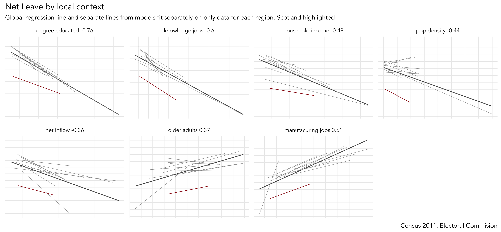
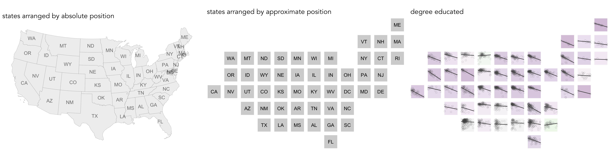

= Explaining Trump and Brexit with Tidy Data Graphics
By <https://www.roger-beecham.com[Roger Beecham]>
:docinfo1: menu-include.adoc
:icons: font
:source-highlighter: rouge
:source-language: R
:task: sidebar
:aside: NOTE
:stem: latexmath
:fig: TIP
:alert: WARNING
:specification: source,R

include::menu-include.adoc[]

****
In this session you will:

* perform a linear regression analysis and use graphics to make decisions about model fit
* generate graphical small multiples with `ggplot2`
* make use of more involved _dplyr_ functions, such as `gather()`, for preparing R data frames for charting

****

== Investigate candidate 'explanations' behind area-level vote

=== Task 1. Association between Trump and Brexit and levels of (degree) education

We finished the previous session by plotting maps of area-level voting behaviour and of area-level demographics. Visually scanning across the maps, you _might_ have observed that area-level variation in the vote co-varies with demographic characteristics. Any systematic co-variation would be interesting given the popular discourse on the Trump and Brexit vote -- that they're symptomatic of people and places structurally https://www.theguardian.com/politics/2016/jun/25/left-behind-eu-referendum-vote-ukip-revolt-brexit[left behind] by economic change.

==== Create a scatterplot of _degree-educated_ on the outcome

.Figure 1: Scatterplots containing varying extents of correlation coefficient.
--
image:images/correlation.png[]
--
[{aside}]
--
A much-cited, but nevertheless compelling, argument for the use of visualization in data analysis -- https://en.wikipedia.org/wiki/Anscombe%27s_quartet[Anscombe's quartet] -- make great use of the scatterplot. For a fun take on this, see this https://www.autodeskresearch.com/publications/samestats[CHI paper]. You can reproduce plots of your own in R using the https://github.com/stephlocke/datasauRus[datasauRus] package.
--

The association between demographics and the voter outcome variables can be analysed more directly through correlation analysis.  You will have learnt that the _correlation coefficient (r.)_ summarises the strength of linear association between two variables. It is a quantity that ranges from perfect negative correlation (-1) to perfect positive correlation (+1) and can be considered a measure of _effect size_ to the extent that it describes how much of something (correlation in this case) exists.

The code below allows our outcome variables and demographic characteristics to be examined using this quantity as well as visually through a scatterplot.

[source]
--
# Calculate correlation coefficient of net_trump by degree-educated.
trump  %>%
  summarise(r=cor(net_trump, degree_educated)) %>%
  pull(r)

# Generate scatterplot of net_trump by degree-educated. Draw OLS regression line.
trump %>%
  ggplot(aes(x=net_trump, y=degree_educated))+
    geom_point(colour="#525252",pch=21, alpha=0.5)+
    geom_smooth(method = "lm", se = FALSE, colour="#525252")

--

[{task}]
--
[horizontal]
Instructions:: Add the code block to your R script and Run. Do the same for _net_shift_ and _net_leave_.
--

==== Inspect residuals from linear model for quantifying effect of _degree-educated_ on the outcome

There appears to be a reasonably strong negative linear association between the Trump and Leave outcome variabls and the proportion of residents in counties and LADs educated to degree-level and above. This strength of association is greatest for the Brexit data (_r. -0.76_) and for the US, _degree-educated_ is more heavily associated with _shift_trump_ than _net_trump_ (_r. -0.56_ vs. _r. -0.46_). We can _model_ for this relationship and talk about the effect of _degree-educated_ on the our outcome variables using linear regression.

We have already generated a line representing this linear model with the command: `geom_smooth(method = "lm", se = FALSE)`. We can also generate an object storing model parameters and functions with the `lm()` command.

[source]
--
# Generate a univariate linear model object regressing net_trump on the
# degree-educated variable. Store object with name "lm_trumpshift_degrees".
lm_trumpshift_degrees <- lm(shift_trump ~ degree_educated, data=trump)

summary(lm_trumpshift_degrees)
# Call:
#   lm(formula = shift_trump ~ degree_educated, data = trump)
#
# Residuals:
#   Min        1Q    Median        3Q       Max
# -0.200727 -0.031906 -0.002687  0.030099  0.145821
#
# Coefficients:
#   Estimate Std. Error t value Pr(>|t|)
# (Intercept)      0.125315   0.001942   64.52   <2e-16 ***
#   degree_educated -0.320837   0.008559  -37.48   <2e-16 ***
#   ---
#   Signif. codes:  0 ‘***’ 0.001 ‘**’ 0.01 ‘*’ 0.05 ‘.’ 0.1 ‘ ’ 1
#
# Residual standard error: 0.04361 on 3106 degrees of freedom
# Multiple R-squared:  0.3115,	Adjusted R-squared:  0.3112
# F-statistic:  1405 on 1 and 3106 DF,  p-value: < 2.2e-16

--

[{task}]
--
[horizontal]
Instructions:: Run the code in the block above. You can generate a summary of the model output with the following call: `summary(<model-object>)`.
--

The regression coefficients that appear after calls to `summary(<model-object>)` simply describe the regression line -- and the regression line tells us, on average, what the _shift_trump_ vote would be if it were entirely dependent on the proportion of the population educated to degree-level.  Since there is a negative association between _net_trump_ and _degree-educated_, the _slope_ of the regression line is negative. The coefficient for _degree-educated_ (`Estimate Std. -0.32`) can be interpreted as: a one unit increase in the _degree-educated_ population in a county has the effect of decreasing the _shift_trump_ variable by c.0.32 units.

But how successful is this model? To what extent is variation in _shift_trump_ entirely a function of variation in the proportion of people in counties educated to _degree-level_? It is possible to quantify how well the model fits the data, and importantly _where_ it fits the data, by calculating _residuals_. Residuals are simply the difference between an observed value and the value expected by the model. The coefficient of determination (R-squared) is the sum of squared residuals divided by the squared sum of total residuals (or variance). It tells us how much of the variation in the outcome can be accounted for by the model. In this case 31% of variation in the observed _shift_trump_ variable can be explained with variation in the _degree-educated_ variable  (see output screen).

Ideally residuals should follow a https://en.wikipedia.org/wiki/Normal_distribution[normal distribution] and distribute randomly around the regression line, with no obvious systematic structure. One means of testing for normality is to generate a histogram on the residual variable, as in the block below.

[source]
--
# Extract and store model residuals as a new variable.
trump <- trump %>%
  mutate(resids_shift_degrees=as_tibble(resid(lm_trumpshift_degrees))$value)

# Plot histogram of residuals.
trump %>%
  ggplot(aes(resids_shift_degrees))+
  geom_histogram()

# Scatterplot of observed data coloured by residual.
trump %>%
  ggplot(aes(x=degree_educated, y=shift_trump, fill=resids_shift_degrees))+
  geom_point(colour="#525252",pch=21, alpha=0.8)+
  geom_smooth(method = "lm", se = FALSE, colour="#525252")+
  scale_fill_distiller(palette="RdBu", direction=1, name="", limits=c(-0.21,0.21))

# Lineup test for spatial autocorrelation in residuals.

# Create the lineup data.
lineup_data <- trump %>%
  select(value=resids_shift_degrees)
lineup_data <- do_lineup(lineup_data, 1)
lineup_data <- lineup_data %>%
  select(p1:p9) %>%
  gather(key="perm", value="perm_values", -geometry)

# Plot the line-up.

# Using geom_sf and development version of ggplot2.
# Takes up plenty of graphics space so store as an object and write out to .png.
map_lineup <- lineup_data %>%
  ggplot()+
    geom_sf(aes(fill=perm_values), colour="#bdbdbd", size=0.05)+
    coord_sf(crs=st_crs(lineup_data), datum=NA)+
    facet_wrap(~perm)+
    scale_fill_distiller(palette="RdBu", direction=1, limits=c(-0.21,0.21), guide=FALSE, name="")+
    theme(axis.title=element_blank())
# Write out to .png.
ggsave("./map_lineup.png",plot=map_lineup, width=22, height=18, units="cm")

# Using the tmap package.
map_lineup <- lineup_data %>%
  tm_shape() +
    tm_fill(col="perm_values", style="cont", size=0.2, id="county_name", palette="-RdBu", title="")+
    tm_borders(col="#636363", lwd=0.2)+
    tm_facets("perm")+
    tm_layout(frame=FALSE, legend.show=FALSE)
ggsave("./map_lineup.png",plot=map_lineup, width=22, height=18, units="cm")

--

[{task}]
--
[horizontal]
Instructions:: Run the code in the block above to generate a summary views on the residuals.

Individual coding task:: Re-run the code block on the Brexit dataset. What do you notice about the distribution of residuals in the Brexit data and what does this imply for your data analysis?
--

As can be seen from the histogram, the distribution of residuals is reasonably normal though not entirely symmetrical -- some counties contain large negative residuals where we overestimate the _shift_trump_ variable given the levels of _degree_education_ there. The choropleth map, however, suggests a very obvious spatial structuring to the residuals -- the univariate model underestimates the extent of _trump shift_ in Northern and Eastern states given those counties' (degree-level) demographics; the corollary is true for counties in Southern and Western states. The 'smoothness' of this spatial pattern is surprising (although there is a strong border around Utah and counties in neighbouring states).

Linear regression assumes _no_ spatial autocorrelation in residuals. That it exists suggests that there is some systematic change or behaviour that we are not capturing adequately in our model. Exploring a richer set of explanatory variables may help address some of the spatial dependency in residuals. However, it is also possible that the explanatory variables organise differently over space, that different processes operate in different locations and that there are geographically-varying interactions between variables.

.Figure 2: Map lineup of residuals from model assuming _shift_trump_  is a linear function of _degree_educated_.
--
image:images/map_lineup.png[map_lineup,1000]
--

[{aside}]
--
Geographers typically test for _spatial autocorrelation_ using spatial statistics -- https://en.wikipedia.org/wiki/Moran%27s_I[Moran's I] is a measure of effect size for spatial autocorrelation. They do so by comparing an observed value of Moran's I against a theoretical distribution that would result under _complete spatial randomness_ (CSR) -- in this case, this is the assumption that residuals distribute around counties entirely independent of location.

Of course in Figure 2 we perform such a test visually -- comparing the observed choropleth against a set of choropleths that one might expect to see under CSR.
--

=== Task 2. Association between Trump and Brexit and other candidate variables

.Figure 3: Small multiple plots displaying associations between _net_leave_ and area-level demographics.
--

--

You will by now have noticed that there are several area-level explanatory variables in the _Brexit_ and _Trump_ data frames. These have been carefully selected based on existing literature around the rise of populist voting behaviour. We will make comparisons in associations between our outcome variables and these area-level variables visually, using https://en.wikipedia.org/wiki/Small_multiple[small multiples] -- a set of graphics juxtaposed next to one another, ideally in a meaningful order, such that graphics can be compared.

_ggplot2_ usefully supports small multiples with functions such as `facet_wrap()` and `facet_grid()`. A requirement of calls to _ggplot2_'s `facet` functions is https://cran.r-project.org/web/packages/tidyr/vignettes/tidy-data.html[Tidy] data -- where just one observation appears per row. Rows in the the data frame are then split and a separate chart is created for each tranche of data.

To generate small multiples of the scatterplots in the previous section, we have to collapse our data frame such that a single row is given to each county or LAD _and_ explanatory variable -- basically we need to make our data frame taller and thinner. The _tidyr_ package provides methods that allow these types of operations. In the code block below the `gather()` method is used to collapse multiple columns into rows. Remember you can check the documentation for this function by typing into the R Console `?gather`.

Rather than clutter the small multiples with individual points, only the regression lines are shown. This is achieved with a slight hack -- we set `geom_point()` with total transparency (`alpha=0`). The bold lines in Figure 3 represent the overall regression line and in grey are separate lines for each GB region. The addition of the regional lines allows us to investigate whether the scale and interaction between variables is regionally specific. General heuristics:

* Parallel slopes with little variation in vertical position (e.g. _degree-educated_ with the obvious exception of Scotland) -- variation is not regionally structured and that interactions between variables are generally consistent.
* Parallel slopes with large variation in vertical position (_household_income_) -- variable's scale is regionally structured but a consistent association exists.
* Substantial changes in slope (_older_adults_?) -- regional specificity in the scale of those variables and perhaps the nature of association with the outcome.

[source]
--
# Small multiple plot of associations with _net_leave_ and area-level demographics.
# First gather() variables to include in the  plot, so that we can supply variable name to facet_wrap().
# Create a global regression line based on all points (stat_smooth).
# And one contingent on region (group=region_abbr).
brexit %>%
  gather(c(degree_educated:pop_density), key = "var", value="value") %>%
  ggplot(aes(x=value, y=net_leave))+
  geom_point(colour="#525252",pch=21, alpha=0) +
  stat_smooth(method=lm, se=FALSE, size=0.5, colour="#525252")+
  stat_smooth(aes(group=region_abbr), method=lm, se=FALSE, size=0.2, colour="#969696")+
  facet_wrap(~var, scales="free", nrow=3)+
  theme(axis.text=element_blank(),
        axis.title=element_blank())
--

[{task}]
--
[horizontal]
Instructions:: Run the code in the block above to generate small multiple summaries of associations.

Individual coding task:: Re-run the code block on the Trump and Brexit dataset to make comparisons across our three outcome variables. Remember, we assume that US counties and states and regions and LADs are roughly equivalent geographies. What do you notice about these associations?
--

[{aside}]
--
Whilst one form of _untidy_ data is observations distributed amongst columns, the reverse is also common -- where observations are duplicated amongst rows. _tidyr_ provides a helper function (`spread()`) that has the opposite effect to `gather()` -- unsurprisingly, this spreads duplicated observations amongst columns, creating new variables.
--

=== Task 3. Interrogate into regionally-varying association

.Figure 4: Spatially ordered map of associations between _degree-educated_ and _net_trump_.
--

--

Hopefully from the analysis above you have developed some insight into associations between the Trump and Brexit outcome variables and area-level demographics. Augmenting our plots with _local_ regression lines provides useful additional information. Firstly, it is very likely that the _scale_ of variables might be different in different parts of the country -- a density plot of small multiples (faceted on state) shows that income distributions tend to be higher and wider in the counties of New England than those in Southern Central US. Such distinctions are important: a consistent pattern of interactions between demographics and voting behaviour might exist, but these interactions can be hidden in global models that do not allow for local context – that assume each each US county and GB LAD results from the same population and process. Secondly, it is also possible that very different processes are operating between these two regions – that the extent and even direction of association between income and voting preference may vary for these different parts of the US.

There are techniques that can be used to account for this -- for examlpe, I've recently published a paper (http://openaccess.city.ac.uk/19048/[Beecham et al., in press]) applying https://en.wikipedia.org/wiki/Multilevel_model[multi-level] modelling and https://onlinelibrary.wiley.com/doi/full/10.1111/j.1538-4632.1996.tb00936.x[geographically-weighted statistics] on the Brexit dataset. Both of these approaches (multi-level modelling and geographical weighted statistics) result in some form of _local_ parameter estimates -- and we've already generated local estimates in Figure 3 with the addition of regionally-varying regression lines above. An important analytic task remains: to characterise spatial patterns in these locally-varying estimates. I'd argue that this is a task that visualization uniquely supports.

So our final activity is to explore how the differing associations between the outcome variables and area-level demographics implied by the plots above vary over space. We will do so by generating _spatially arranged_ small multiples: separate plots describing associations in each US state and GB region, but with plots arranged according to their approximate spatial position. You will notice in the code block below that to affect such an arrangement requires only a minimal modification to the ggplot2 specification: `facet_grid(x~y)` -- where `x,y` describes the approximate position of each state/region.

[{specification}]
--
# Faceted scatterplot of degree_educated on net_trump arranged according to approximate spatial position.
trump %>%
ggplot()+
  geom_point(aes(x=degree_educated, y=net_trump), colour="#525252",pch=21, alpha=0.2)+
  stat_smooth(aes(x=degree_educated, y=net_trump), method=lm, se=FALSE, size=0.6, colour="#525252")+
  facet_grid(gridY~gridX, shrink=FALSE, scales = "free_x")

# I have encapsulated a more detailed specification into a function in a separate R script.
# Load into R session.
source(paste0(session_url, "./src/build_scatter_region.R"))

# Generate a tibble without geometry list-col (there's a boring reason for this).
trump_ungeom <- trump
st_geometry(trump_ungeom) <- NULL

# Call build_scatter_region() function to  ggplot2 object.
build_region_scatter(trump_ungeom, quo(degree_educated), quo(net_trump), quo(state_abbr))
--

[{task}]
--
[horizontal]
Instructions:: Run the code in the block above to generate small multiple summaries of associations.

Individual coding task:: I have encapsulated a more detailed specification as a function. In addition to plotting individual data points and a regression line, plot background is varied according to size of association (_r._) with the outcome. Once loaded, you can use this function to generate spatially ordered plots of other explanatory variables.
--

[{aside}]
--
There is an established literature in information visualization on how to effect semi-spatial arrangements. For an overview and  interesting and elegant approach, see https://www.gicentre.net/small-multiples-with-gaps/[Meulemans _et al._ (2017)].

You might have noticed a strange function (`quo`) used when we pass variable names as parameters into  `build_region_scatter()`. The reason for this is that the _dplyr_ functions we use throughout (and also in `build_refion_scatter()`) use non-standard evaluation -- they are not referentially transparent -- and this creates problems when we wish to make use of _dplyr_ programmatically. For a coherent, efficient and accessible discussion, see this post on https://dplyr.tidyverse.org/articles/programming.html[programming with dplyr].
--

== References

* Beecham, R. et al. (in press) http://openaccess.city.ac.uk/19048/[Locally-varying explanations behind the United Kingdom's vote to leave the United Kingdom]. _Journal of Spatial Information Science_.

* Meulemans, W. et al. (2017) http://openaccess.city.ac.uk/15167/[Small multiples with gaps]. _IEEE Transactions on Visualization & Computer Graphics_, 23(1):381–390. Code and web-interface is available at the https://www.gicentre.net/featuredpapers/#/meulemanssmall2016/[paper website].

---

[small]#Content by http://www.roger-beecham.com[Roger Beecham] | 2018 | Licensed under https://creativecommons.org/licenses/by/4.0/[Creative Commons BY 4.0].#
