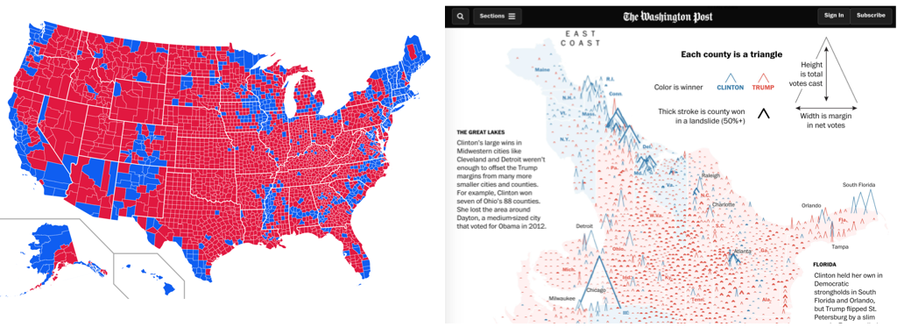

= Explaining Trump and Brexit with Tidy Data Graphics
By <https://www.roger-beecham.com[Roger Beecham]>
:docinfo1: menu-include.adoc
:icons: font
:source-highlighter: coderay
:task: sidebar
:aside: NOTE
:stem: latexmath
:fig: TIP
:specification: source,R

include::menu-include.adoc[]

[[data-vis]]
== Data Visualization

Data Visualization is a broad field influenced in different ways by scientists, journalists, designers and many more.  Whilst the intentions of those producing data graphics varies, data visualization is seen as increasingly necessary to _modern_ data analysis -- where visual approaches are used to explore structure in large, often repurposed datasets and to communicate that structure and associated uncertainty information.

Tools for creating data visualizations vary from low-level programming environments that offer immense flexibility (e.g. https://www.processing.org[Processing]) to higher level frameworks aimed to support rapid generation of (re-configurable) graphics (e.g. http://ggplot2.tidyverse.org/index.html[ggplot2], https://www.processing.org[Vega-Lite]).

There is a large literature defining visualization and providing guidelines on good visualization design (a set of primers appears in the reference list). However, effective data graphics typically have the following characteristics:

1. Represent data dimensions, connections and comparisons that could not be achieved using non-visual means.
2. Are data rich: present many numbers in a small space.
3. Reveal patterns at several levels of detail: from broad overview to fine structure.
4. De-emphasise non-data items and omit redundant information.

Considering these characteristics, take a look at the data graphics below, which present results data from the 2016 US Presidential Election. Use the links to read the full stories (and data analyses) that accompany the graphics.

--

--
.Figure 1: Maps of 2016 US presidential election results. Left - two-colour choropleth in https://pensivepost.com/understanding-rural-america-d9695a6b3516[Medium]. Right - information-rich data graphic in https://www.washingtonpost.com/graphics/politics/2016-election/election-results-from-coast-to-coast/[The Washington Post].

Both maps use 2016 county-level results data, but the  https://www.washingtonpost.com/graphics/politics/2016-election/election-results-from-coast-to-coast/[The Washington Post] graphic graphic encodes many more data items than the Medium post (see table below).

It is not simply the data density that makes the Washington Post graphic successful. The authors carefully incorporated annotations and transformations in order to support comparison and emphasise structure. By varying the height of triangles according to the number of votes cast, the thickness according to whether or not the result for Trump/Clinton was a landslide and rotating the scrollable map 90 degrees, the very obvious differences between metropolitan, densely populated coastal counties that voted emphatically for Clinton and the vast number of suburban, provincial town and rural counties (everywhere else) that voted Trump, were exposed.

[cols="40%,30%,30%",options="header", width="70%"]
|====
|*Data item* |*Washington Post* |*Medium*
|County location |icon:check[] |icon:check[]
|County result |icon:check[] |icon:check[]
|State result |icon:check[] |
|County votes cast (~pop size) |icon:check[] |
|County result margin |icon:check[] |
|County result landslide |icon:check[] |
|====

[[gog]]
== Describing, evaluating and creating data graphics

[quote, Edward Tufte, 1983]
____
Data graphics visually display measured quantities by means of the combined use of points, lines, a coordinate system, numbers, symbols, words, shading, and color.
____

In the Washinton Post piece, we saw a judicious mapping of data to visuals, underpinned by a careful understanding of analysis context. Information Visualization -- an academic discipline devoted to the study of data graphics -- provides a language for describing this process as well as empirically-informed guidelines to support design choices.

=== Description and evaluation

In her influential book http://www.cs.ubc.ca/~tmm/vadbook/[_Visualization Analysis and Design_], Tamara Munzner enumerates commonly used _visual marks_ -- geometric primitives such as points, lines and areas -- and _visual channels_ that determine how marks appear (presented in Figure 2).

When creating data graphics, we specify a mapping of data items to visual channels. Some visual channels are more appropriate at showing certain data types than others. Munzner (2014) differentiates channels that are appropriate for representing _categorical_ attributes from those appropriate for _ordered_ and _quantitative_ attributes. Munzner ranks these visual channels according to their effectiveness. We'll skip the details for now, but this is an empirically-derived ordering based on decades of perception-based research in Information Visualization (Cleveland & McGill 1984 ; Heer & Bostock 2010) -- we are  confident it is correct.

.Figure 2: Data channels ordered by effectiveness. In Munzner (2014: 102).
--

--

=== Description and evaluation: example of the scatterplot

As an example of how we might map data attributes to visual channels in a graphic, let's consider a familiar example of a scatterplot constructed to analyse the 2016 US election dataset.

When presenting data in a scatterplot, we usually mark observations using _points_. These _points_ are typically mapped to at least one visual channel: _position_ on the x-axis (the proportion of people in a US county with degrees) and on the y-axis (the proportion of voters in a US county supporting Trump). If we so wished, it would also be possible to vary the _area_ of points according to something meaningful -- for example, a county's population size (Figure 3a).

The attributes so far describe quantities. If an attribute existed that described US counties in some other way (whether a county was rural, provincial town or big city), those _categories_ could be distinguished by perhaps faceting the scatterplot to create separate versions of the plots for each category of county (Figure 3b). Considering Munzner's (2014) ordering, we may wish to use containment within _spatial region_ (look back to Figure 2) as a visual channel. For Munzner, _spatial region_ describes the arrangement of small multiples in a display -- this arrangement is not necessarily a geo-spatial one. However, US states are also a useful _category_ to facet on and can clearly be arranged using containment. If we are to facet to form individual scatterplots for each state, it makes sense to arrange the small multiples according to their approximate spatial position rather than some arbitrary ordering (Figure 3b).

.Figure 3: Scatterplots of US county-level data: share in county degree-educated against share in county voting Trump in 2016 election.
--

--

Notice that in this example of mappings, I am paying attention to the _types_ of attributes that I wish to encode, importance to my analysis and the effectiveness of visual channels at representing those attributes. The main purpose is to explore the possible association between levels of education in a county and that county's preference for Trump. I am using _position on a common scale_ -- the most effective visual channel -- for encoding these quantities. The focus on county size (number of votes) is a secondary one, so I relegate this quantity to the _area_ channel. And the county-type (urban-rural) is a categorical attribute and so I map this to the _spatial region_ channel. As political/administrative entities, states are categorically distinct; however, they can be _ordered_ according to their spatial position and so the careful use of ordering within spatial region in Figure 3c.

[{aside}]
--
_Arrangement_ or _layout_ into spatial region is an important property to consider when designing data graphics. In Figure 3a and 3b, a scatterplot is faceted to form _small multiples_ -- a series of charts that share the same scale and axes and arranged for easy comparison. Notice that when faceted on state, the scatterplots are arranged according to their approximate geographic position. There is a large literature on how to effect semi-geographic arrangements. https://www.gicentre.net/small-multiples-with-gaps/[Meulemans _et al._ (2017)] provides an overview and suggests an interesting and elegant approach.
--

.Question
[{task}]
--
Can you identify the mappings of data to visual channel used in the Washington Post map?
(I've listed some in the <<misc>> section.)
--

=== Description and creation: the grammar of graphics

_Describing_ graphics in abstract terms, as with the scatterplots above and previously the Washington Post map, is useful not only for comparison of designs. Such abstract descriptions force careful consideration of the data and visual channels available and the comparisons that mappings should support: they encourage good design.

In the late 1990s, the Computer Scientist and Statistician Leland Wilkinson introduced the http://www.springer.com/gb/book/9780387245447[_Grammar of Graphics_] -- a framework for coherently and consistently describing data graphics. Wilkinson's grammar separates a chart into a series of layers: data (clearly), transformations on that data (filters, various aggregations and binning procedures),  visual marks used to represent data, a scaling that is applied when mapping data to marks (e.g. linear, log or square root) and a coordinate system (e.g. Cartesian, Polar, map projection). Once expressed in these terms, visualization design is a case  of combining layers in different ways, but under a helpfully narrow vocabulary.

The _Grammar of Graphics_ has been extremely influential in the design of high-level frameworks and technologies for visual data analysis.  https://www.tableau.com[Tableau] is underpinned by the _Grammmar of Graphics_; http://ggplot2.org[ggplot2] is a very direct implementation of Wilkinson's theory and https://vega.github.io/vega-lite/[Vega-Lite] combines  a similar implementation to ggplot2, but is native to the web and, as of version `2.0`, with a _grammar of interaction_.

.Figure 4: ggplot2 is a framework for describing visualizations. It is closely built upon Leland Wilkinson's _Grammar of Graphics_.
--

--

== Further reading

* Munzner, T. (2014) https://www.crcpress.com/Visualization-Analysis-and-Design/Munzner/p/book/9781466508910[Visualization Analysis & Design], _CRC Press_. Tamara Munzner, Professor of Information Visualization at University of British Columbia, provides a systematic and empirically-grounded framework for thinking about visualization. Available as an e-book via the University of Leeds Library. Chapters 2 and 5 are worth special consideration.

* Wickham, H. (2016) https://www.springer.com/us/book/9780387981413[ggplot2: Elegant Graphics for Data Analysis 2nd Ed]. _Springer_.

== References

* Cleveland, W. & McGill, R. (1984) http://www.tandfonline.com/doi/abs/10.1080/01621459.1984.10478080[Graphical Perception: Theory, Experimentation, and Application to the Development of Graphical Methods].
_Journal of the American Statistical Association_, 79(387): 532--554.

* Heer, J. & Bostock, M. (2010) http://idl.cs.washington.edu/papers/crowdsourcing-graphical-perception[Crowdsourcing graphical perception: Using Mechanical Turk to assess visualization design], _Proceedings of the SIGCHI Conference on Human Factors in Computing Systems_, pp. 203--212.

* Munzner, T. (2014) https://www.crcpress.com/Visualization-Analysis-and-Design/Munzner/p/book/9781466508910[Visualization Analysis & Design], _CRC Press_.

[#misc]
== Miscellany
[cols="80%,20%", width="70%"]
|====
|Two *marks* were used (lines and triangles) |
|*Colour hue* (a categorical channel) was _mapped_ to a categorical attribute | 
|*Orientation* (a quantitative channel) was _mapped_ to a quantitative attribute (change in margin size)   | 
|*Length* (a quantitative channel) was _mapped_ to quantitative attributes (number votes, size of margin)   |   |
|====

[small]#Content by http://www.roger-beecham.com[Roger Beecham] | 2018 | Licensed under https://creativecommons.org/licenses/by/4.0/[Creative Commons BY 4.0].#
