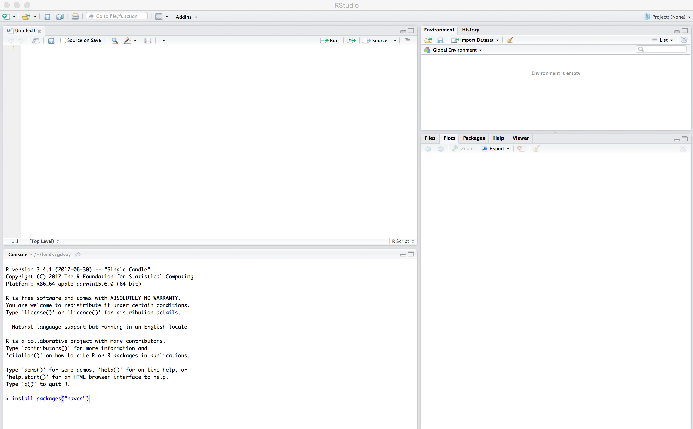

= Explaining Trump and Brexit with Tidy Data Graphics
By <https://www.roger-beecham.com[Roger Beecham]>
:docinfo1: menu-include.adoc
:icons: font
:source-highlighter: coderay
:task: sidebar
:aside: NOTE
:stem: latexmath
:fig: TIP
:specification: source,R

include::menu-include.adoc[]

== What is R?

R is a free, open statistical programming language and environment. Released as open source software as part of a research project in 1995, for some time R was the preserve of academics. From 2010s onwards, with the advent of _Big Data_ and new sub-disciplines such as _Data Science_, R enjoyed rapid growth and is used increasingly outside of academia, by organisations such as Google [https://research.google.com/pubs/pub37483.html[example]], Facebook [http://flowingdata.com/2010/12/13/facebook-worldwide-friendships-mapped/[example]], Twitter [https://blog.twitter.com/official/en_us/a/2013/the-geography-of-tweets.html[example]], New York Times [http://www.nytimes.com/interactive/2012/05/05/sports/baseball/mariano-rivera-and-his-peers.html?ref=baseballexample[example]] and many more.

Rather than simply a free alternative to proprietary statistical analysis software such as SPSS, R is a programming language in and of itself and can be used for:

* Data Visualization design: http://spatial.ly/2014/08/population-lines/[PopulationLines]

* Developing interactive (visualization) software:  https://gehlenborglab.shinyapps.io/upsetr/[UpSet]

* As a GIS: http://robinlovelace.net/geocompr/[Geocomp with R]

* As a word processor / web publisher: http://rmarkdown.rstudio.com/gallery.html[R Markdown]

== Why R?

=== Free, open-source with an active community

The cost motive is obvious, but the benefits that come from being fully open-source, with a critical mass of users are many.

Firstly, there is a burgeoning array of online forums, tutorials and code examples through which to learn R. https://stackoverflow.com/questions/tagged/r[StackOverflow] is a particularly useful resource for answering more individual questions.

Second, with such a large community, there are numerous expert R users who themselves contribute by developing _libraries_ or _packages_ that extend its use.

[{aside}]
--
An R package is a bundle of code, data and documentation, usually hosted centrally on the CRAN (Comprehensive R Archive Network). A particularly important, though very recent, set of packages is the http://www.tidyverse.org[tidyverse]: a set of libraries authored mainly by http://hadley.nz[Hadley Wickham], which share a common underlying philosophy, syntax and documentation.
--

=== R supports **modern** data analysis workflows

[quote, Roger Peng, Jeff Leek and Brian Caffo]
____
Reproducible research is the idea that data analyses, and more generally, scientific claims, are published with their data and software code so that others may verify the findings and build upon them.
____

In recent years there has been much introspection around how science works -- around how statistical claims are made from reasoning over evidence. This came on the back of, amongst other things, a high profile paper published in http://science.sciencemag.org/content/349/6251/aac4716[Science], which found that of 100 recent peer-reviewed psychology experiments, the findings of only 39 could be replicated. The upshot is that researchers must now make every possible effort to make their work transparent. In this setting, traditional data analysis software that support point-and-click interaction is unhelpful; it would be tedious to make notes describing all interactions with, for example, SPSS. As a declarative programming language, however, it is very easy to provide such a provenance trail for your workflows in R since this necessarily exists in your analysis scripts.

Concerns around the _reproducibility crisis_ are not simply a function of transparency in methodology and research design. Rather, they relate to a culture and incentive structure whereby scientific claims are conferred with authority when reported within the (slightly backwards) logic of Null Hypothesis Significance Testing (NHST) and _p-values_. This isn't a statistics session, but for an accessible read on the phenomenon of _p-hacking_ (with interactive graphic) see https://fivethirtyeight.com/features/science-isnt-broken/#part1[this article] from the excellent http://fivethirtyeight.com[FiveThirtyEight] website. Again, the upshot of all this introspection is a rethinking of the way in which Statistics is taught in schools and universities, with greater emphasis on understanding through computational approaches rather than traditional equations, formulas and probability tables. Where does R fit within this? Simply put: R is far better placed than traditional software tools and point-and-click paradigms for supporting computational approaches to statistics -- with a set of methods and libraries for performing simulations and permutation-based tests.

==  Get familiar with the R and RStudio environment

=== Open RStudio

.Figure 1: Example RStudio interface.
--

--

[{task}]
--
[horizontal]
Instructions:: Open RStudio. Click `File` -> `New File` -> `R Script`.
--

You should see a set of windows roughly similar to those in the figure above. The top left pane is the _Code Editor_. This is where you'll write, organise and comment R code for execution. Code snippets can be executed using `Run` at the top of the RStudio pane or typing `cmd R` (Mac) `ctr R` (Windows).  Below this, in the bottom left pane is the _R Console_, in which you write and execute commands directly. To the top right is a pane with the tabs _Environment_ and _History_. The purpose of these will soon be clear. In the bottom right is a pane for navigating through project directories (_Files_), displaying _Plots_, details of installed and loaded _Packages_ and documentation on the functions and packages you'll use (_Help_).

=== Type some console commands

You'll initially use R as a calculator by typing commands directly into the _Console_. You'll create a variable (`x`) and assign it a value using the assignment operator (`<-`), then perform some simple statistical calculations using functions that are held within the (`base`) package.

[source]
--
# Create variable and assign a value.
x <- 4
# Perform some calculations using R as a calculator.
x_2 <- x^2
# Perform some calculations using functions that form baseR.
x_root <- sqrt(x_2)
--

[{task}]
--
[horizontal]
Instructions:: Type the commands contained in the code block above into your R Console.
--

[{aside}]
--
The `base` package is core and native to R. Unlike all other packages, it does not need to be installed and called explicitly. One means of checking the package to which a function you are using belongs is to call the help command (`?`) on that function: e.g. `?mean()`.
--

== Further reading

There is a burgeoning set of books, tutorials and blogs introducing R as an environment for applied data analysis. Detailed below are resources that are particularly relevant to the material and discussion introduced in this session.

=== R for data analysis

* Wickham, H. & Grolemund, G. (2017), http://r4ds.had.co.nz[R for Data Science], O'Reilly. _The_ primer for doing data analysis with R. Hadley presents his _thesis_ of the data science workflow and illustrates how R and packages that form the _Tidyverse_ support this. It is both accessible and coherent and is highly recommended.

* Lovelace, R., Nowosad, J. & Muenchow, J. (in preparation) http://robinlovelace.net/geocompr/[Geocomputation with R], CRC Press. Currently under development but written by Robin Lovelace (University of Leeds) and others, this book comprehensively introduces spatial data handling in R. It is a great complement to _R for Data Science_ in that it draws on brand new libraries that support _Tidyverse_-style operations on spatial data.

=== New Statistics and the reproducibility crisis (non-essential)

* Aschwanden, C. & King, R. (2015) https://fivethirtyeight.com/features/science-isnt-broken/[Science Isn’t Broken: It’s just a hell of a lot harder than we give it credit for]. A lovely take on the reproducibility crisis, published on http://fivethirtyeight.com[FiveThirtyEight] with an excellent interactive graphic.

* Cumming, G. (2013) http://journals.sagepub.com/doi/abs/10.1177/0956797613504966[The New Statistics: Why and How]. Geoff Cumming exposes  common misconceptions associated with NHST and makes a case for a New Statistics, centred on estimation-based approaches.  Despite the pre-historic graphics, his https://www.youtube.com/watch?v=3FjoUOolOYQ[dance of the p-values] video is well worth a watch.

{empty} +

---

[small]#Content by http://www.roger-beecham.com[Roger Beecham] | 2018 | Licensed under https://creativecommons.org/licenses/by/4.0/[Creative Commons BY 4.0].#
